<!-- ## 六轴DIY机械臂
## 高速并联运动平台
## 五轴工业机械臂
## 仿生惯性传感器
## 多关节仿生机械腿
## 双足机器人
## 塞尔达机械腿
## 被动阻尼机械腿 -->

## High performance motion platform
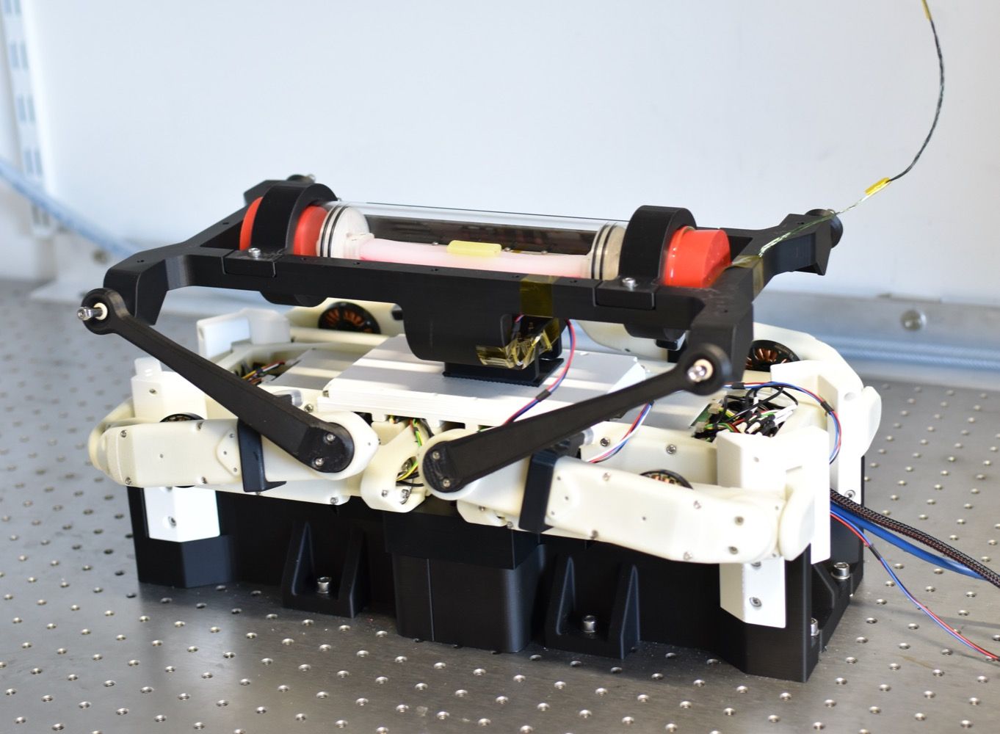
[YouTube](https://youtu.be/BtfoymwgIUY) | [Bilibili](https://www.bilibili.com/video/BV1q24y1t7qt/)

## Viscous damping in legged locomotion
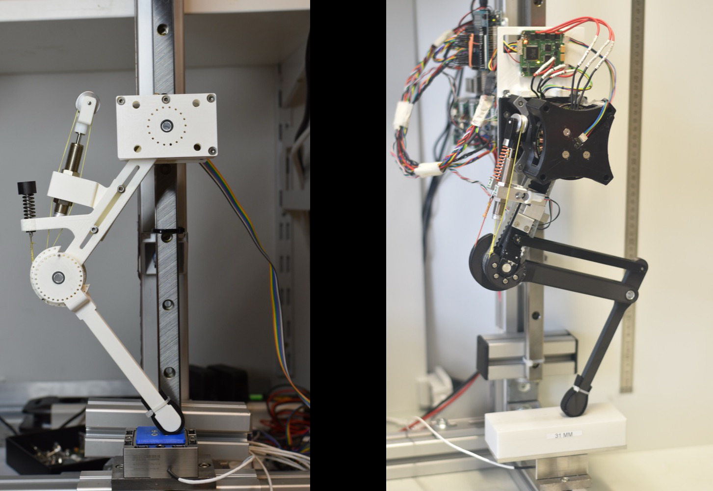
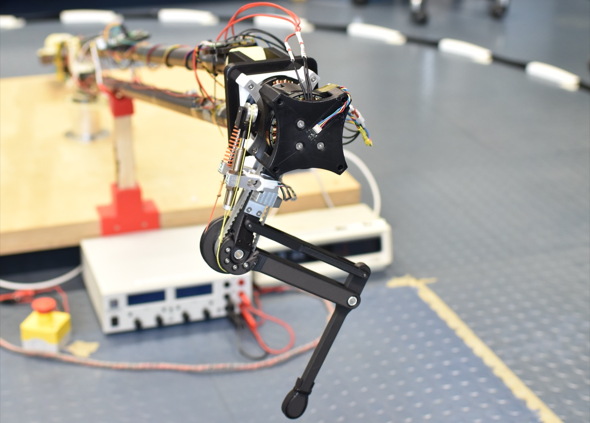
[YouTube 1](https://youtu.be/F00Sma2BQ4c) | [YouTube 2](https://youtu.be/Sa-q-5NucGY) | [Bilibili](https://www.bilibili.com/video/BV1W84y1P7K6/) | [Publication 1](http://dx.doi.org/10.3389/frobt.2020.00110) | [Publication 2](http://dx.doi.org/10.1038/s41598-023-30318-3) | [Publication 3](http://arxiv.org/abs/2202.02114)

## 6-axis robot arm - Sechs
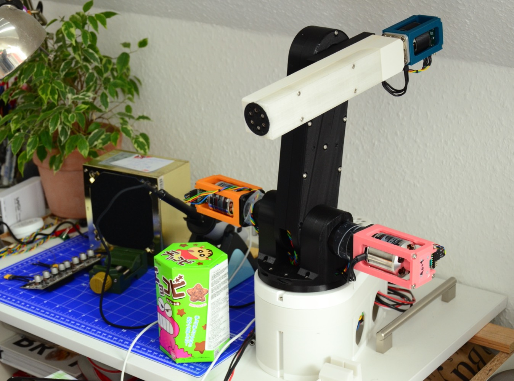
[YouTube](https://youtu.be/u9WMYN56ERQ) | [Bilibili](https://www.bilibili.com/video/BV1eY4y11734/)

## 5-axis robot arm - CRS A255
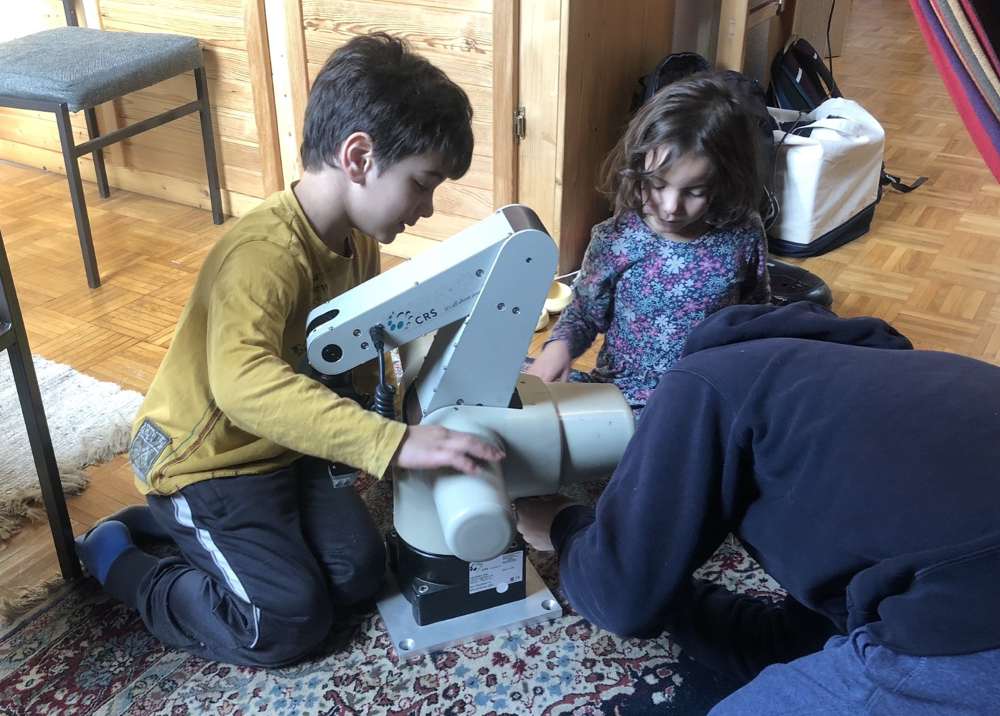
[YouTube](https://youtu.be/jmlB4CtnPN8) | [Bilibili](https://www.bilibili.com/video/BV1vM41177hY/)

## Bipedal robot
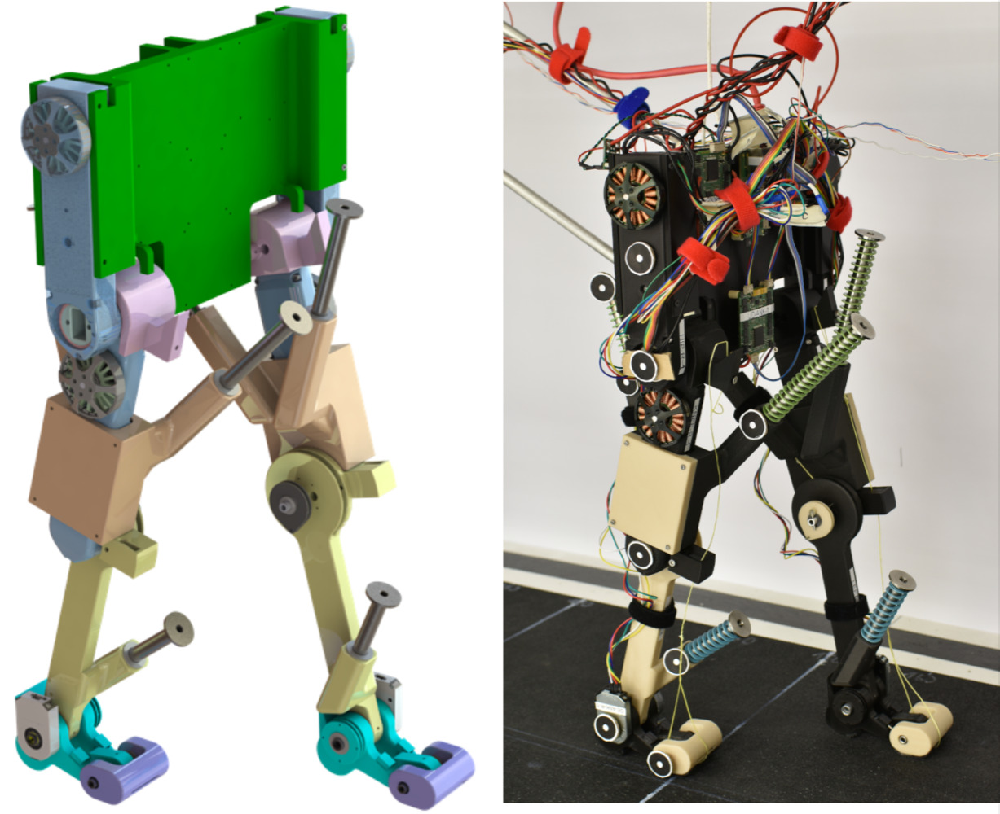
[YouTube](https://youtu.be/T79pKLQ47XU) | [Bilibili](https://www.bilibili.com/video/BV13Y4y1w7x8/) | [Publication](https://doi.org/10.1109/IROS47612.2022.9981725)

## Adaptive feet
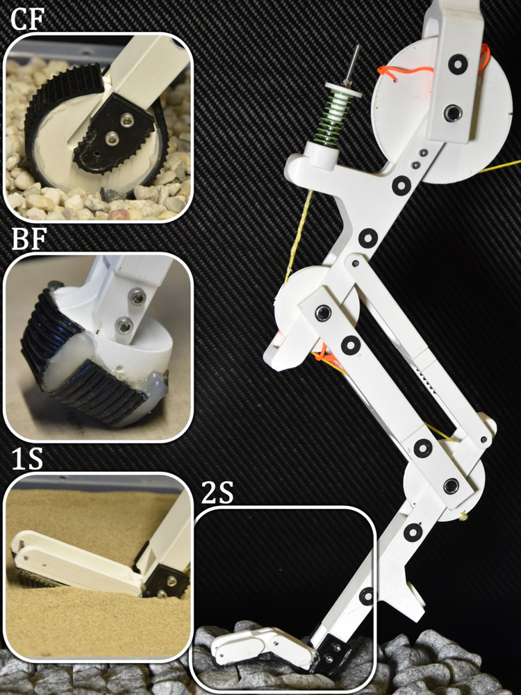
[YouTube](https://youtu.be/tJ7v81YDGRE) | [Publication](https://arxiv.org/abs/2209.08499)

## SELDA hopper
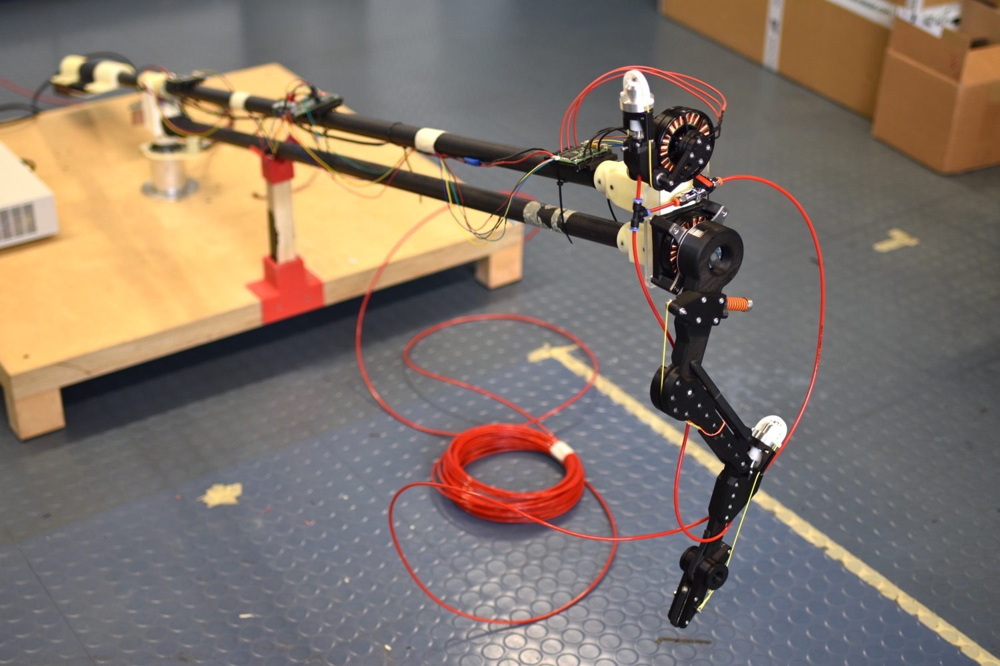
[YouTube](https://youtu.be/P1zkDmtD-hs) | [YouTube](https://youtu.be/Qvn7sKSEOTg) | [Publication](https://doi.org/10.1109/IROS47612.2022.9981060)

## Pin array gripper
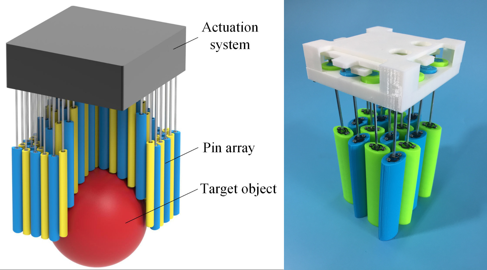
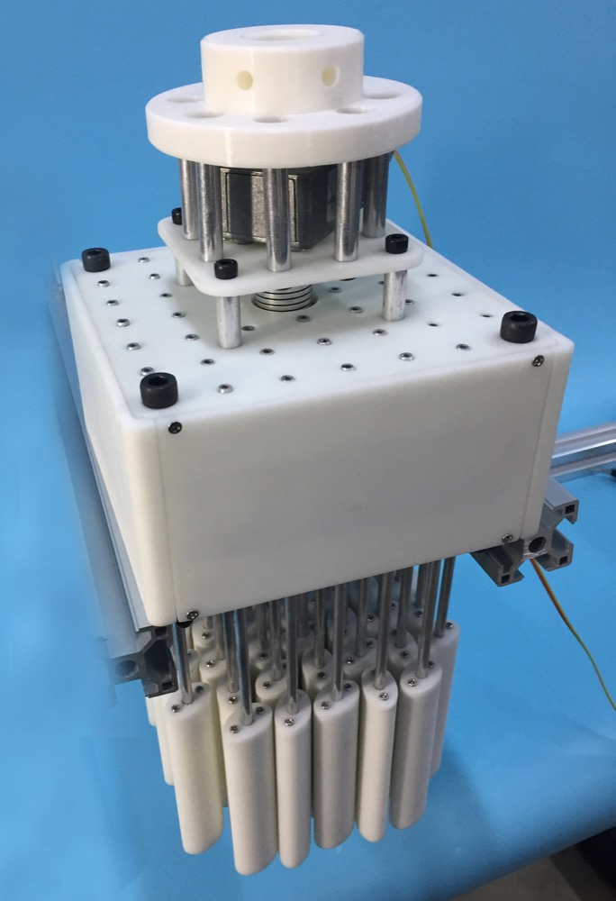
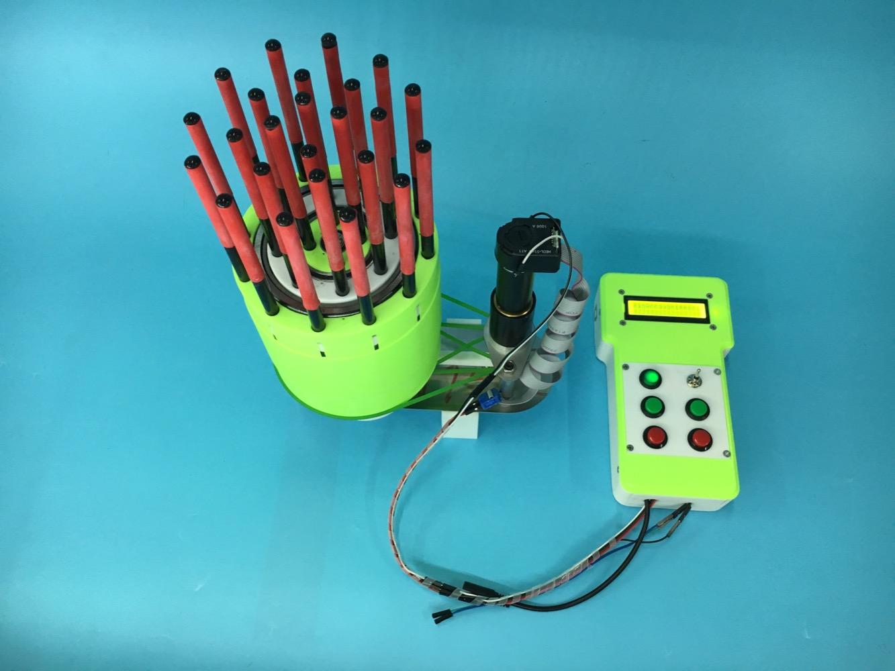
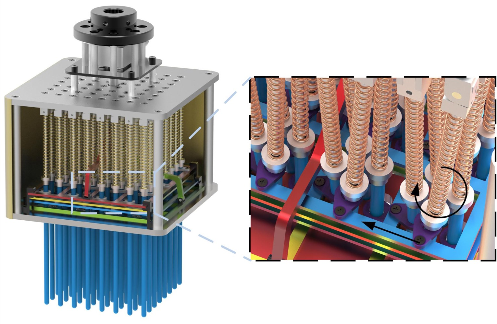
[YouTube 1](https://youtu.be/ONr0l3ZMhpk) | [YouTube 2](https://youtu.be/GtAgCxQsDeI) | [Bilibili 1](https://www.bilibili.com/video/BV1RF4114717/) | [Bilibili 2](https://www.bilibili.com/video/BV1mF411s7Rg/) | [Publication 1](https://doi.org/10.1109/ROBIO.2017.8324725) | [Publication 2](https://doi.org/10.1007/978-3-319-97589-4_9) | [Publication 3](https://doi.org/10.1109/ICARM.2018.8610678) | [Publication 4](https://doi.org/10.1177/1729881419834781) | [Publication 5](http://scis.scichina.com/en/2019/050214.html)

## 1-dof motion simulator
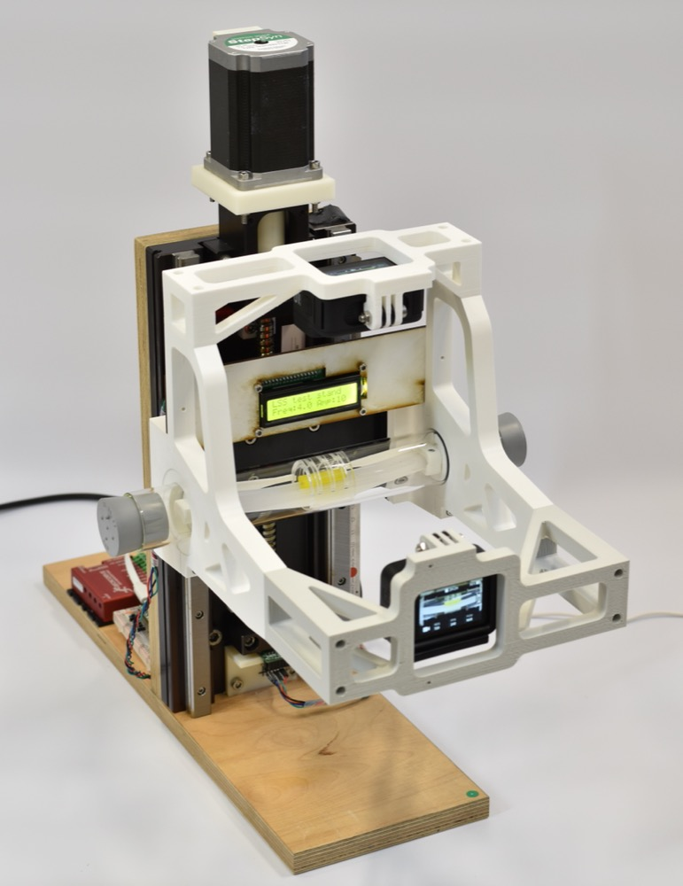
[Github](https://github.com/moanan/1_dof_motion_simulator)

## Intraspinal mechanosensing in avians
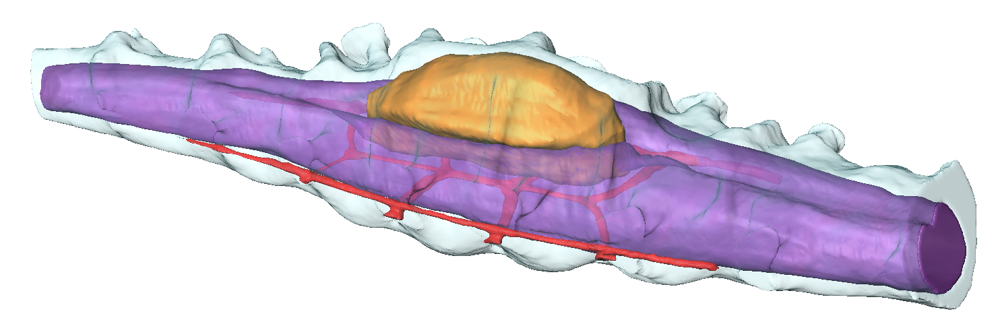
[YouTube](https://youtu.be/g1EZH8dM_jw) | [Publication](https://arxiv.org/abs/2212.11485)

## High-throughput screening (HTS)
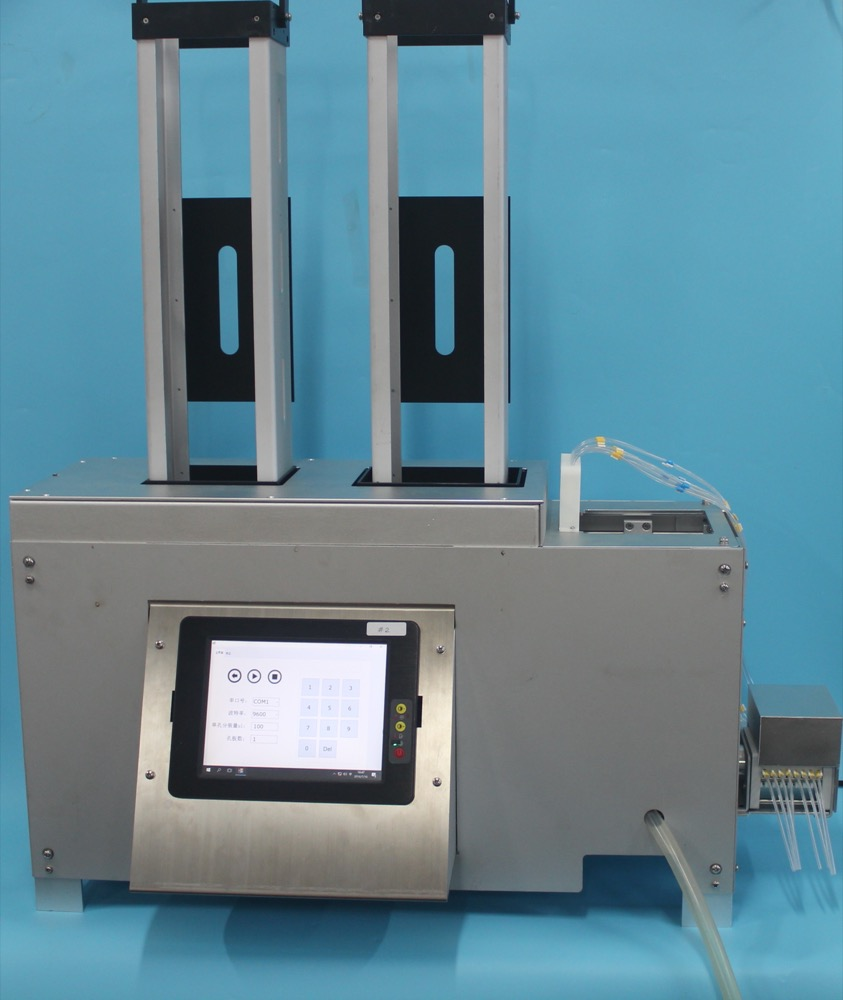
[YouTube_TBD](https://youtu.be/VE1dYkJHatw) | [Publication](https://doi.org/10.1115/1.4030985)

